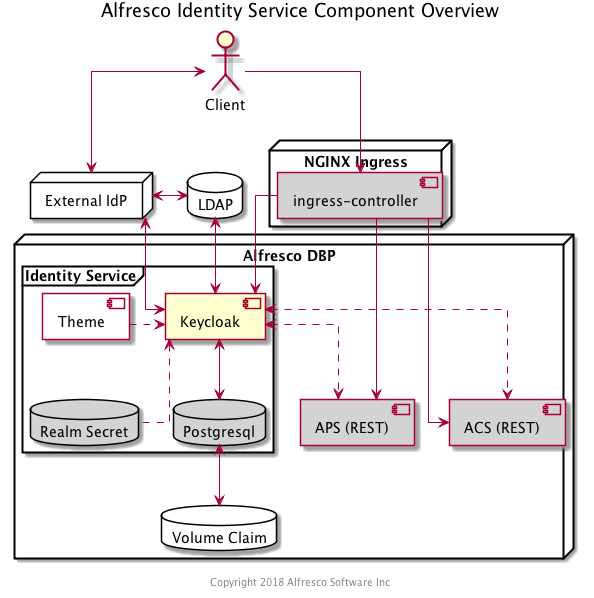
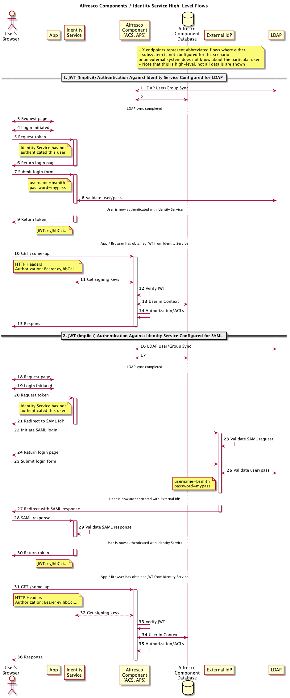

## Alfresco Identity Service

### Purpose
The Alfresco Identity Service was initially introduced to the architecture as a means for Client Applications to implement single sign-on
across components of the Digital Business Platform (via [OpenID Connect](https://openid.net/connect/)) while providing the option to 
delegate authentication of the user to an external Identity Provider over protocols like SAML, OpenID Connect, and LDAP.

Aspects of Common Identity and Governance are likely to be the responsibility of the Identity Service in the future.

*** 

### Overview
The Identity Service leverages the open source identity and access management project [Keycloak](https://www.keycloak.org/).  An example
realm file containing a pre-defined 'alfresco' client and login theme are imported on bootstrap.

Client Applications can obtain a JSON Web Token (JWT) via OpenID Connect which can then be presented in a Bearer Authorization header
in an HTTP request against REST APIs of Alfresco components such as Process Services and Content Services.

The primary deployment mechanism is via a Kubernetes Helm chart, and typically as part of the [alfresco-infrastructure chart](https://github.com/Alfresco/alfresco-infrastructure-deployment).

*** 

### Artifacts and Guidance

Source Code: https://github.com/Alfresco/alfresco-identity-service
License: Apache 2
Issue Tracker: https://issues.alfresco.com/jira/projects/AUTH
Documentation: TODO
Contributions: https://github.com/Alfresco/alfresco-identity-service/blob/master/CONTRIBUTING.md

*** 

### Prerequisite Knowledge
A basic understanding of the following would be helpful in understanding the Identity Service:
* OAuth 2
* OpenID Connect
* SAML
* LDAP
* Kubernetes
* Helm

*** 

### Design

#### Component Model

The components typically involved in a Client Application's single-sign on against DBP REST APIs is perhaps best viewed in the
context of the Kubernetes deployment:

#### Data Model

See the [ADR on JWT details](adrs/0001-Internal-JWT-Token-Details.md).

#### Flows

The details of various auth protocols like SAML and OpenID Connect are readily available on the web so we won't repeat them here,
but here's a high-level overview of a few common scenarios:

### APIs and Interfaces

In its initial introduction, only the endpoints necessary for SAML and Open ID Connect protocols are supported in the Identity Service.

From a UI perspective, an Alfresco login theme is provided, but the admin console is Keycloak's default.

*** 

### Configuration

See the [config directory](config) for details on common configurations.

*** 

### Performance Considerations

The Keycloak chart supports specifying [multiple replicas](https://github.com/helm/charts/tree/master/stable/keycloak#high-availability-and-clustering).

See Keycloak's documentation on configuring [high availability and clustering](https://www.keycloak.org/docs/4.5/server_installation/#_clustering).

Also see the Identity Service [README](https://github.com/Alfresco/alfresco-identity-service#multiple-replicas-high-availability-and-clustering).

*** 

### Security Considerations

See Keycloak's [Server Admin documentation](https://www.keycloak.org/docs/4.5/server_admin/index.html#overview).

*** 

### Cloud Considerations

As a standard Kubernetes deployment the Identity Service can easily be deployed to Cloud environments including managed clusters like AWS
EKS.

See the documentation for specifics on ingress considerations or leveraging native database services rather than deploying Postgresql.

***

### Design Decisions

See the [adrs directory](adrs). 
