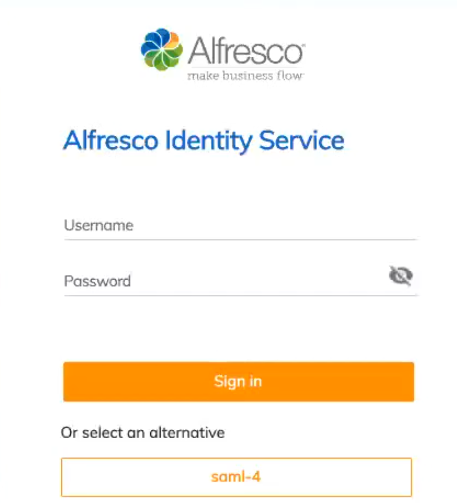

# Configuring a PingFederate instance with the Alfresco Identity Service

The Identity Service can be configured to use PingFederate as an identity provider. The following steps detail this configuration.

## Prerequisites

Ensure you have installed the Identity Service before starting. You will also need to have administrative access to your instance of PingFederate.

## Configuration
There are three main steps involved in configuring a PingFederate instance with the Identity Service:

1. Get the certificate. 
2. Configure your PingFederate connection.
3. Configure the Identity Service with your PingFederate parameters.

### Get the certificate. 

* Open a new text file and paste the following into it.
```
-----BEGIN CERTIFICATE-----

-----END CERTIFICATE-----
```
* In a seperate tab, open the **certificate descriptor API** at **{BASE-URI}/auth/realms/{REALM-NAME}/protocol/saml/descriptor**.
* In the middle of the two lines, add the value found between **<dsig:X509Certificate>** and **</dsig:X509Certificate>** in the **certificate descriptor API** such as in the following example.
```
-----BEGIN CERTIFICATE-----
MIICnzCCAYcCBgFkqEAQCDANBgkqhkiG9w0BAQsFADATMREwDwYDVQQDDAhhbGZyZXNjbzA
-----END CERTIFICATE-----
```
Save the file giving it a name that ends with **.cert**, in this example we will use **certificate.cert**.

### Configure your PingFederate connection

1. Sign in to your PingFederate instance as a user with administrative privileges.
2. Navigate to **SP Connections** and select **Create New**.
3. Ensure the **Browser SSO Profiles** connection template with *Protocol SAML 2.0* is selected and then click **Next**.
4. On the **Connection Options** tab ensure only **Browser SSO** is selected.

5. On the **General Info** tab 
  * In **Parter's Entity Id** add the value given for **Location** in the **certificate descriptor API**, but remove everything after **{REALM-NAME}**.
  * Add a connection name.
  * In Base URL, add {Base-URL}.
7. On the **Browser SSO** tab click **Configure Browser SSO** which will launch a new set of tabs for configuring the browser SSO.

   #### Configuring browser SSO
   1. On the **SAML Profiles** tab tick all four checkboxes.
   2. On the **Assertion Creation** tab click **Configure Assertion Creation** which will launch a new set of tabs for configuring the assertion creation.

      #### Configuring assertion creation
      1. On the **Identity Mapping** tab ensure the **Standard** checkbox is ticked.
      2. Under the heading **Attribute Contract**:
         * Enter *Email* under **Extend the contract**.
         * Choose *urn:oasis:names:tc:SAML:2.0:attrname-format:basic* from the **Attribute name format** dropdown and click **Add**.
         * Enter *FirstName* under **Extend the contract**.
         * Choose *urn:oasis:names:tc:SAML:2.0:attrname-format:basic* from the **Attribute name format** dropdown and click **Add**.
         * Enter *LastName* under **Extend the contract**.
         * Choose *urn:oasis:names:tc:SAML:2.0:attrname-format:basic* from the **Attribute name format** dropdown and click **Add**.
      3. On the **Authentication Source Mapping** tab click **Map New Adapter Instance...** which will launch a new set of tabs for mapping a new adapter instance.

         #### Mapping a new adapter instance
         1. On the **Adapter Instance** tab select *IdP Adapter* from the dropdown menu.
         2. On the **Attribute Contract Fulfillment** tab:
             * In the **email** row select *Adapter* from the **source** dropdown.
             * In the **email** row select *email* from the **value** dropdown.
             * In the **SAML_SUBJECT** row select *Adapter* from the **source** dropdown.
             * In the **SAML_SUBJECT** row select *subject* from the **value** dropdown.
             * In the **FirstName** row select *Adapter* from the **source** dropdown.
             * In the **FirstName** row select *fname* from the **value** dropdown.
             * In the **LastName** row select *Adapter* from the **source** dropdown.
             * In the **LastName** row select *lname* from the **value** dropdown.
          3. On the **Summary** tab select **Done** to return to the assertion configuration tabs.

      4. On the **Summary** tab verify the values are as per the following screenshot.
      
      5. Click **Done** to return to the browser SSO configuration tabs.

   3. On the **Protocol Settings** tab click **Configure Protocol Settings** which will launch a new set of tabs for configuring the protocol settings.

      #### Configuring protocol settings
      1. On the **Assertion Consumer Service URL** tab:
        * Choose **POST** from the dropdown menu under **BINDING**.
        * In **ENDPOINT URL**, add the value given for **Location** in the **certificate descriptor API**.
        * Click add. 
      
      2. On the **SLO Service URLs** tab:
        * Choose **POST** from the dropdown menu under **BINDING**.
        * In **ENDPOINT URL**, add the value given for **Location** in the **certificate descriptor API**.
        * In **RESPONSE URL**, add the value given for **Location** in the **certificate descriptor API**.
        * Click add.
        
      3. On the **Allowable SAML Bindings** tab untick all of the checkboxes except for **POST**.
      4. On the **Signature Policy** tab tick **Require AuthN requests to be signed when received via the POST or Redirect bindings**.
      5. On the **Encryption Policy** tab ensure that the **None** checkbox is ticked.
      6. On the **Summary** tab verify that the values are as per the following screenshot.
      
      7. Click **Done** to return to the browser SSO configuration tabs.

   4. On the **Summary** tab click **Done** to return to the main SP connection configuration tabs.

8. On the **Credentials** tab click **Configure Credentials** which will launch a new set of tabs for configuring the credentials. 

   #### Configuring credentials
   1. On the **Digital Signature Settings** tab
    * select your organization's key pair and certificate from the **Signing Certificate** dropdown. 
    * Tick the box below **Include the certificate in the signature <KeyInfo> element**.
   2. On the **Signature Verification Settings** tab click **Manage Signature Verification Settings** which will launch a new set of tabs for the signature verification settings.

      #### Signature verification settings
      1. On the **Trust Model** tab select *Unanchored*.
      2. On the **Signature Verification Certificate** tab click **Manage Certificate**.
      3. Click **Import** and browse for the `.cert` file you created earlier in the **Filename** field.
      4. Note the imported certificate's **Serial Number** similar to the following screenshot.
      
      5. Click **Done**.
      6. Still on the **Signature Verification Certificate** tab select the certificate with the ID (serial number) from the previous step from the **Primary** dropdown.
      7. Click **Done** to return to the credentials configuration tabs.

   3. On the **Summary** tab click **Done** to return to the main SP connection configuration tabs.

9. On the **Activation & Summary** tab tick the **Active** checkbox in the **Connection Status** row and **Save**. 

10. Back on the identity service homepage, click **Manage all SP**.
11. Your new connection should now appear in the **SP Connections** list. To the right of it click **Export metadata**.
12. In the summary tab, click **Export**.


### Identity Service Configuration

* At the Identity Service homepage, navigage to **Identity providers**.
* Click on **Add provider...**.
* Click on **SAML v2.0**.
* Edit the name of alias if needed. This will be the name provided at the log in. Such as saml-4 in the following screen shot:


* Scroll down to **Import from file** and click **Select file**.
* And chose the file that you downloaded as part of the **Export metadata** step.


Now you should see that all your pingfederate configurations have been populated.
* Scroll up to **NameID Policy Format** and select **Unspecified** from the drop down menu. 
* Scroll to **Valid Redirect URIs** and add your base URI followed by a "*" such as **https://arepository.dev-live.acompany.me**.

### Configure Mappers
This section allows an existing SAML user to be automatically created in Identity Service without a SAML user needing to fill in a form on their first log in.

* In the left column, navigate to Mappers.
* Click Create.
* Provide the following values:
Name: Email
Mapper type: Attribute importer
Attribute name: Email
Friendly name: Email
User attribute Name: Email
* Click save.

Now repeat the process two more times with the following values:

Name: FirstName
Mapper type: Attribute importer
Attribute name: FirstName
Friendly name: FirstName
User attribute Name: FirstName

Name: LastName
Mapper type: Attribute importer
Attribute name: LastName
Friendly name: LastName
User attribute Name: LastName


