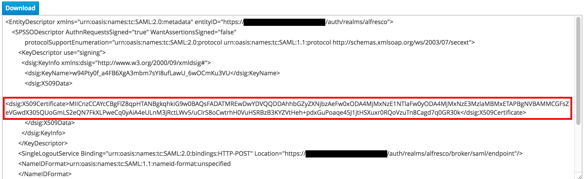

# Configuring a PingFederate instance with the Alfresco Identity Service

The Identity Service can be configured to use PingFederate as an identity provider. The following steps detail this configuration.

## Prerequisites

Ensure you have installed the Identity Service before starting. You will also need to have administrative access to your instance of PingFederate.

## Configuration
There are three main steps involved in configuring a PingFederate instance with the Identity Service:

1. Obtain your parameters from PingFederate.
2. Configure the Identity Service with your PingFederate parameters.
3. Configure your PingFederate connection.

### 1. Obtain parameters from PingFederate
1. Sign in to your PingFederate instance as a user with administrative privileges.
2. Select **Server Settings** from the **System Settings** menu.
3. Make a note of the value for *My Base URL* under the **Federation Info** heading.
4. Click **Main** and select **Federation Settings** or **IdP Configuration**, then click **Protocol Endpoints**.
5. Make a note of the *Redirect* values for *Single Logout (SLO) Service* and *Single Sign-on (SSO) Service* under the **SAML v2.0 Endpoints** heading.
6. Combine the value of *My Base URL* (from Step 3) with *Single Logout (SLO) Service* and *My Base URL* (from Step 3) with *Single Sign-on (SSO) Service* ready to enter into the Identity Service.

For example:
> If *My Base URL* is `"https://pingfederate.test.com:9031"` and *Single Sign Logout (SLO) Service* is `"/idp/SLO.saml2"` then the POST SLO service URL is `https://pingfederate.test.com:9031/idp/SLO.saml2`

### 2. Configure the Identity Service
1. Sign in to the administrator panel of the Identity Service using the following URL: `https://$ELBADDRESS/auth/admin`

   **Note:** The `$ELBADDRESS` will be the one used [during deployment](../../README.md).

2. Select the correct realm to configure PingFederate against.

   **Note:** If using the default deployment options, the realm will be called `Alfresco`.

3. In the **Settings** of `alfresco` client (if using the default deployment options) save the following configuration:

   * Switch **Implicit Flow Enabled** on.
   * Enter `https://$ELBADDRESS*` in **Valid Redirect URIs**.
   * Click **+** and enter your application front end URI into the next line of **Valid Redirect URIs**.

4. Select **Identity Providers** from the left hand navigation menu and choose *SAML v2.0* in the **Add Provider** dropdown.

>. Take note of the value given in **Redirect URI**

5. Enter the values you obtained from PingFederate in the first section into **Single Sign-On Service URL** and **Single Logout Service URL**.
6. Make the following configurations:

   * Choose *Unspecified* in the **NameID Policy Format** dropdown.
   * Switch **HTTP-POST Binding Response** on.
   * Switch **HTTP-POST Binding for AuthnRequest** on.
   * Switch **HTTP-POST Binding Logout** on.
   * Switch **Want AuthnRequests Signed** on.
   * Choose the appropriate algorithm for your setup from the dropdown in **Signature Algorithm**.
   * Choose *NONE* in the **SAML Signature Key Name** dropdown.

7. After clicking **Save**, navigate to the **Mappers** tab and select **Create**.
8. Make the following configurations:

   * Enter *email* into **Name**.
   * Choose *Attribute Importer* from the **Mapper Type** dropdown.
   * Enter *EMAIL* into **Attribute Name**.
   * Enter *email* into **User Attribute Name**.

9. After clicking **Save** navigate back to the **Identity Provider Mappers** using the breadcrumb and select the **Export** tab.
10. Click **Download** and make a note of the file name and download location.
11. Create a file with the extension `.cert` (the file name isn't important other than to locate it later on) with the following content:

    ```
    -----BEGIN CERTIFICATE-----
    -----END CERTIFICATE-----
    ```

12. Open the file you downloaded in Step 10 with a text editor.
13. Find the line beginning with the tag `<dsig:X509Certificate>` and ending with `</dsig:X509Certificate>`.

14. Copy the string in-between these tags and paste the content into the file you created in Step 11 in-between `-----BEGIN CERTIFICATE-----` and
    `-----END CERTIFICATE-----`.
    
The contents of your `.cert` file should now look similar to the following:

```
-----BEGIN CERTIFICATE-----
MIICnzCCAYcCBgFkqEAQCDANBgkqhkiG9w0BAQsFADATMREwDwYDVQQDDAhhbGZyZXNjbzA
-----END CERTIFICATE-----
```

### 3. Configure your PingFederate connection

1. Sign in to your PingFederate instance as a user with administrative privileges.
2. Navigate to **SP Connections** and select **Create New**.
3. Ensure the **Browser SSO Profiles** connection template with *Protocol SAML 2.0* is selected and then click **Next**.
4. On the **Connection Options** tab ensure only **Browser SSO** is selected.
>5. On the **General Info** tab 
  * Add the *Redirect URI* value that you noted in step >>> but remove */broker/saml/endpoint*.
  * Add a connection name.
  * Add the *Redirect URI* value that you noted in step >>> under *Base URL* but this time remove everything up to the first forward slash such as */auth/realms/alfresco/broker/saml/endpoint*.
7. On the **Browser SSO** tab click **Configure Browser SSO** which will launch a new set of tabs for configuring the browser SSO.

   #### Configuring browser SSO
   1. On the **SAML Profiles** tab tick all four checkboxes.
   2. On the **Assertion Creation** tab click **Configure Assertion Creation** which will launch a new set of tabs for configuring the assertion creation.

      #### Configuring assertion creation
      1. On the **Identity Mapping** tab ensure the **Standard** checkbox is ticked.
      2. Under the heading **Attribute Contract**:
         * Enter *Email* under **Extend the contract**.
         * Choose *urn:oasis:names:tc:SAML:2.0:attrname-format:basic* from the **Attribute name format** dropdown and click **Add**.
         * Enter *FirstName* under **Extend the contract**.
         * Choose *urn:oasis:names:tc:SAML:2.0:attrname-format:basic* from the **Attribute name format** dropdown and click **Add**.
         * Enter *LastName* under **Extend the contract**.
         * Choose *urn:oasis:names:tc:SAML:2.0:attrname-format:basic* from the **Attribute name format** dropdown and click **Add**.
      3. On the **Authentication Source Mapping** tab click **Map New Adapter Instance...** which will launch a new set of tabs for mapping a new adapter instance.

         #### Mapping a new adapter instance
         1. On the **Adapter Instance** tab select *IdP Adapter* from the dropdown menu.
         2. On the **Attribute Contract Fulfillment** tab:
             * In the **email** row select *Adapter* from the **source** dropdown.
             * In the **email** row select *email* from the **value** dropdown.
             * In the **SAML_SUBJECT** row select *Adapter* from the **source** dropdown.
             * In the **SAML_SUBJECT** row select *subject* from the **value** dropdown.
             * In the **FirstName** row select *Adapter* from the **source** dropdown.
             * In the **FirstName** row select *fname* from the **value** dropdown.
             * In the **LastName** row select *Adapter* from the **source** dropdown.
             * In the **LastName** row select *lname* from the **value** dropdown.
          3. On the **Summary** tab select **Done** to return to the assertion configuration tabs.

      4. On the **Summary** tab verify the values are as per the following screenshot.
      
      5. Click **Done** to return to the browser SSO configuration tabs.

   3. On the **Protocol Settings** tab click **Configure Protocol Settings** which will launch a new set of tabs for configuring the protocol settings.

      #### Configuring protocol settings
      1. On the **Assertion Consumer Service URL** tab:
        * Choose **POST** from the dropdown menu under **BINDING**.
        * Add the whole of the *Redirect URI* value that you noted in step >>> to **ENDPOINT URL**.
        * Click add. 
      
      2. On the **SLO Service URLs** tab:
        * Choose **POST** from the dropdown menu under **BINDING**.
        * Add the whole of the *Redirect URI* value that you noted in step >>> to **ENDPOINT URL**.
        * Add the whole of the *Redirect URI* value that you noted in step >>> to **RESPONSE URL**.
        * Click add.
        
      3. On the **Allowable SAML Bindings** tab untick all of the checkboxes except for **POST**.
      4. On the **Signature Policy** tab untick **Require AuthN requests to be signed when received via the POST or Redirect bindings**.
      5. On the **Encryption Policy** tab ensure that the **None** checkbox is ticked.
      6. On the **Summary** tab verify that the values are as per the following screenshot.
      
      7. Click **Done** to return to the browser SSO configuration tabs.

   4. On the **Summary** tab click **Done** to return to the main SP connection configuration tabs.

8. On the **Credentials** tab click **Configure Credentials** which will launch a new set of tabs for configuring the credentials. 

   #### Configuring credentials
   1. On the **Digital Signature Settings** tab select your organization's certificate from the **Signing Certificate** dropdown. 
   2. On the **Signature Verification Settings** tab click **Manage Signature Verification Settings** which will launch a new set of tabs for the signature verification settings.

      #### Signature verification settings
      1. On the **Trust Model** tab select *Unanchored*.
      2. On the **Signature Verification Certificate** tab click **Manage Certificate**.
      3. Click **Import** and browse for the `.cert` file you created earlier in the **Filename** field.
      4. Note the imported certificate's **Serial Number** similar to the following screenshot.
      
      5. Click **Done**.
      6. Still on the **Signature Verification Certificate** tab select the certificate with the ID (serial number) from the previous step from the **Primary** dropdown.
      7. Click **Done** to return to the credentials configuration tabs.

   3. On the **Summary** tab click **Done** to return to the main SP connection configuration tabs.

9. On the **Activation & Summary** tab tick the **Active** checkbox in the **Connection Status** row and **Save**. 

Your new connection should now appear in the **SP Connections** list.
