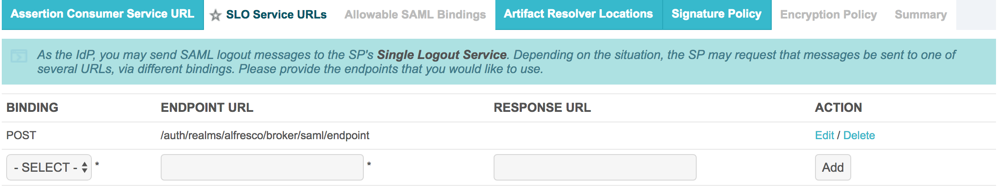
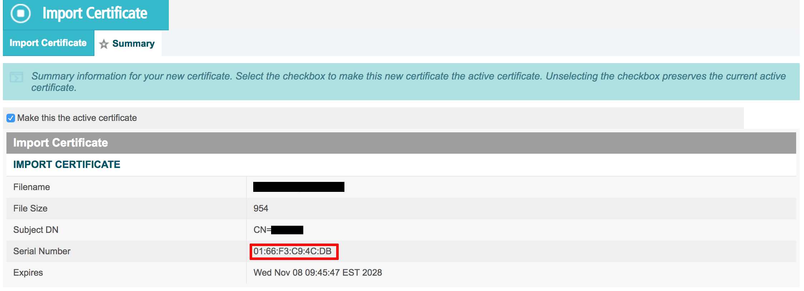

# Configuring a PingFederate instance with the Alfresco Identity Service

The Identity Service can be configured to use PingFederate as an identity provider. The following steps detail this configuration.

## Prerequisites

Ensure you have installed the Identity Service before starting. You will also need to have administrative access to your instance of PingFederate.

## Configuration
There are three main steps involved in configuring a PingFederate instance with the Identity Service:
1. Obtain Identity Service's cryptographic certificate. 
2. Configure the PingFederate connection.
3. Configure Identity Service with the PingFederate parameters.

### Obtain Identity Service's cryptographic certificate.

1. In the browser, open the **certificate descriptor API** at **https://$ELBADDRESS/auth/realms/alfresco/protocol/saml/descriptor**.
**Note:** The `$ELBADDRESS` will be the one used [during deployment](../../README.md).
2. Open a new text file and paste the following into it.
```
-----BEGIN CERTIFICATE-----

-----END CERTIFICATE-----
```

3. In the middle of the two lines, add the value found between **<<dsig:X509Certificate>>** and **</dsig:X509Certificate>** in the **certificate descriptor API** such as in the following example.
```
-----BEGIN CERTIFICATE-----
MIICnzCCAYcCBgFkqEAQCDANBgkqhkiG9w0BAQsFADATMREwDwYDVQQDDAhhbGZyZXNjbzA
-----END CERTIFICATE-----
```
4. Save the file giving it a name that ends with **.cert**, in this example we will use **certificate.cert**.

### Identity Service Configuration
1. Sign in to the administrator panel of the Identity Service using the following URL: `https://$ELBADDRESS/auth/admin`.
2. Select the correct realm to configure PingFederate against.
   **Note:** If using the default deployment options, the realm will be called `Alfresco`.
3. In the **Settings** of `alfresco` client (if using the default deployment options) save the following configuration:<br />
      a. Switch **Implicit Flow Enabled** on.<br />
      b. Enter `https://$ELBADDRESS*` in **Valid Redirect URIs**.<br />
      c. Click **+** and enter your application front end URI into the <br />next line of **Valid Redirect URIs**.
4. Navigate to **Identity providers**.
5. Click on **Add provider...**.
6. Click on **SAML v2.0**.
7. Edit the alias name for this identity provider. This alias will be presented to users on the Identity Service log-in screen.
8. Scroll down to **Import from file** and click **Select file**.
9. Scroll to the top and copy the value of **Redirect URI**.
10. Leave this tab open for later.

### Configure the PingFederate connection

1. Sign in to your PingFederate instance as a user with administrative privileges.
2. Navigate to **SP Connections** and select **Create New**.
3. Ensure the **Browser SSO Profiles** connection template with **Protocol SAML 2.0** is selected and then click **Next**.
4. On the **Connection Options** tab ensure only **Browser SSO** is selected.
5. On the **General Info** tab:<br /> 
    a. In **Partner’s Entity Id** add the value given for **entityID** in the **certificate descriptor API**.<br />
    b. Add a connection name.<br />
    c. In Base URL, add $ELBADDRESS.<br />
6. On the **Browser SSO** tab click **Configure Browser SSO** which will launch a new set of tabs for configuring the browser SSO.

   #### Configuring browser SSO
1. On the **SAML Profiles** tab tick all four checkboxes.
2. On the **Assertion Creation** tab click **Configure Assertion Creation** which will launch a new set of tabs for configuring the assertion creation.

  #### Configuring assertion creation
  1. On the **Identity Mapping** tab ensure the **Standard** checkbox is ticked.
  2. Under the heading **Attribute Contract**:<br />
        a. Enter *Email* under **Extend the contract**.<br />
        b. Choose *urn:oasis:names:tc:SAML:2.0:attrname-format:basic* from the **Attribute name format** dropdown and click **Add**.<br />
      c. Enter *FirstName* under **Extend the contract**.<br />
      d. Choose *urn:oasis:names:tc:SAML:2.0:attrname-format:basic* from the **Attribute name format** dropdown and click **Add**.<br />
         e. Enter *LastName* under **Extend the contract**.<br />
        f. Choose *urn:oasis:names:tc:SAML:2.0:attrname-format:basic* from the **Attribute name format** dropdown and click **Add**.
  3. On the **Authentication Source Mapping** tab click **Map New Adapter Instance...** which will launch a new set of tabs for mapping a new adapter instance.

  #### Mapping a new adapter instance
 1. On the **Adapter Instance** tab select *IdP Adapter* from the dropdown menu.
 2. On the **Attribute Contract Fulfilment** tab:<br />
    a. In the **Email** row select *Adapter* from the **source** dropdown.<br />
     b. In the **Email** row select *email* from the **value** dropdown.<br />
     c. In the **FirstName** row select *Adapter* from the **source** dropdown.<br />
     d. In the **FirstName** row select *fname* from the **value** dropdown.<br />
     e. In the **LastName** row select *Adapter* from the **source** dropdown.<br />
     f. In the **LastName** row select *lname* from the **value** dropdown.<br />
     g. In the **SAML_SUBJECT** row select *Adapter* from the **source** dropdown.<br />
     h. In the **SAML_SUBJECT** row select *subject* from the **value** dropdown.<br /> 
  3. On the **Summary** tab select **Done** to return to the assertion configuration tabs.
 4. On the next **Summary** tab verify the values are as per the following screenshot.

 5. Click **Done** to return to the browser SSO configuration tabs.
 6. On the **Protocol Settings** tab click **Configure Protocol Settings** which will launch a new set of tabs for configuring the protocol settings.

  #### Configuring protocol settings
  1. On the **Assertion Consumer Service URL** tab:<br />
        a. Choose **POST** from the dropdown menu under **BINDING**.<br />
        b. In **ENDPOINT URL**, add the value of **Redirect URI**.<br />
        c. Click add. 
  2. On the **SLO Service URLs** tab:<br />
        a. Choose **POST** from the dropdown menu under **BINDING**.<br />
        b. In **ENDPOINT URL**, add the value of **Redirect URI**.<br />
        c. In **RESPONSE URL**, add the value of **Redirect URI**.<br />
        d. Click **add**.
  3. On the **Allowable SAML Bindings** tab untick all of the checkboxes except for **POST**.
  4. On the **Signature Policy** tab tick **Require AuthN requests to be signed when received via the POST or Redirect bindings**.
  5. On the **Encryption Policy** tab ensure that the **None** checkbox is ticked.
  6. On the **Summary** tab verify that the values are as per the following screenshot.
  
  7. Click **Done** to return to the browser SSO configuration tabs.
  8. On the **Summary** tab click **Done** to return to the main SP connection configuration tabs.
  9. On the **Credentials** tab click **Configure Credentials** which will launch a new set of tabs for configuring the credentials. 

 #### Configuring credentials
 1. On the **Digital Signature Settings** tab, select your organization's key pair and certificate from the **Signing Certificate** dropdown. 
 2. On the **Signature Verification Settings** tab, click **Manage Signature Verification Settings** which will launch a new set of tabs for the signature verification settings.

  #### Signature verification settings
  1. On the **Trust Model** tab select *Unanchored*.
  2. On the **Signature Verification Certificate** tab click **Manage Certificate**.
  3. Click **Import** and browse for the `.cert` file you created earlier in the **Filename** field.
  4. Note the imported certificate's **Serial Number** similar to the following screenshot.
  
  5. Click **Done**.
  6. Still on the **Signature Verification Certificate** tab select the certificate with the ID (serial number) from the previous step from the **Primary** dropdown.
  7. Click **Done** to return to the credentials configuration tabs.

**Export configuration settings**
1. On the **Summary** tab click **Done** to return to the main SP connection configuration tabs.
2. On the **Activation & Summary** tab tick the **Active** checkbox in the **Connection Status** row and **Save**. 
3. Back on the identity service homepage, click **Manage all SP**.
4. Your new connection should now appear in the **SP Connections** list. To the right of it click **Export metadata**.
5. In the summary tab, click **Export**.


### Configure Identity Service with the PingFederate parameters
Back in the Identity Service tab that you left open:
1. Chose the file that you downloaded as part of the **Export metadata** step.<br />
    Now you should see that all your PingFederate configurations have been populated.
2. Scroll up to **NameID Policy Format** and select **Unspecified** from the drop down menu. 

### Configure Mappers
This section allows an existing SAML user to be automatically created in Identity Service without a SAML user needing to fill in a form on their first log in.

1. In the left column, navigate to **Mappers**.
2. Click **Create**.
3. Provide the following values:
    ```
    Name: Email
    Mapper type: Attribute importer
    Attribute name: Email
    Friendly name: Email
    User attribute Name: Email
    ```
4. Click **save**.
5. Now repeat the process two more times with the following values:

    ```
    Name: FirstName
    Mapper type: Attribute importer
    Attribute name: FirstName
    Friendly name: FirstName
    User attribute Name: FirstName
    ```
    
    ```
    Name: LastName
    Mapper type: Attribute importer
    Attribute name: LastName
    Friendly name: LastName
    User attribute Name: LastName
    ```
 
