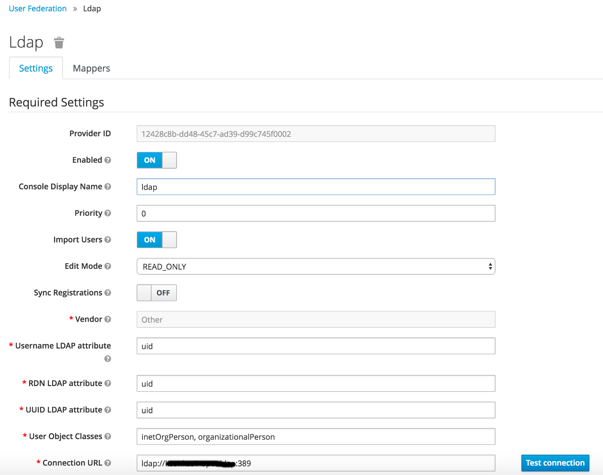
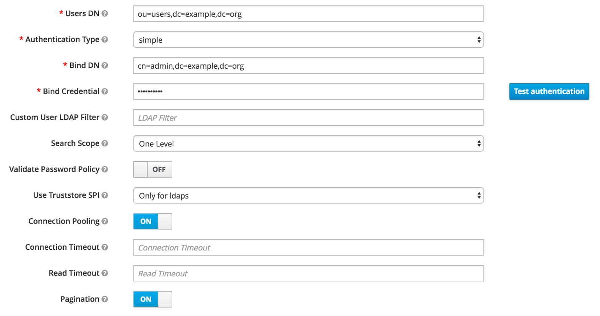

# Identity Service Tests With LDAP provider

These tests verify that a valid JWT token can be generated for users
stored in an external LDAP provider (examples below have been written
for OpenLDAP).

## Prerequisites
- Running Kubernetes environment
- Installed [newman](https://www.getpostman.com/docs/v6/postman/collection_runs/command_line_integration_with_newman)

## Setup
1.  Set environment variable to your Kubernetes namespace:    
    ```bash
    export DESIREDNAMESPACE=example
    kubectl create namespace $DESIREDNAMESPACE
    ```
2. Install OpenLDAP server:
    ```bash
    helm install stable/openldap \
    --name ${DESIREDNAMESPACE}-openldap \
    --namespace $DESIREDNAMESPACE
    ```
3.  Load test data into OpenLDAP server:
    ```bash
    POD_NAME=$(kubectl get pods --namespace $DESIREDNAMESPACE | grep openldap | awk '{ print $1}')
    LDAP_ADMIN_PASSWORD=$(kubectl get secret --namespace $DESIREDNAMESPACE ${DESIREDNAMESPACE}-openldap \
        -o jsonpath="{.data.LDAP_ADMIN_PASSWORD}" | base64 --decode)

    kubectl exec $POD_NAME --namespace $DESIREDNAMESPACE -i -- \
        /usr/bin/ldapadd -vv -D "cn=admin,dc=example,dc=org" \
        -w $LDAP_ADMIN_PASSWORD -H ldap://${DESIREDNAMESPACE}-openldap:389 < ldap-test-data.ldif
    ```
4. Install [Alfresco Identity Service](../../README.md) in `$DESIREDNAMESPACE`
5. Open Alfresco Identity Service [Management Console](https://www.keycloak.org/docs/3.4/server_admin/index.html#admin-console).
   Its URL will be one of `${ELBADDRESS}/auth/admin` or `${ELB_CNAME}/auth/admin`, as configured in step 4.
6. Add your LDAP provider as described in the 
   [Keycloak Administration Guide](https://www.keycloak.org/docs/3.4/server_admin/index.html#_user-storage-federation).
   As its **Connection URL** use the output of the following command:
   ```bash
    echo "ldap://${DESIREDNAMESPACE}-openldap:389"
    ```
    Ensure the following settings are set as listed below (you can leave the
    rest as per their default values):
    
    
    
    
    Click **Test connection**. Provided your LDAP connection was configured correctly, you should
    get the message "Success! LDAP connection successful".
    
    Click **Test authentication**. Provided your test data was imported
    correctly in step 3, you should get the message "Success! LDAP authentication 
    successful".

## Running Tests
Tests can now be run by executing:
```bash
newman run ldap-user-provider-tests.postman_collection.json -d ldap-test-data.json \
--global-var dbpurl=<ELBADDRESS or ELB_CNAME from step 4>
```
