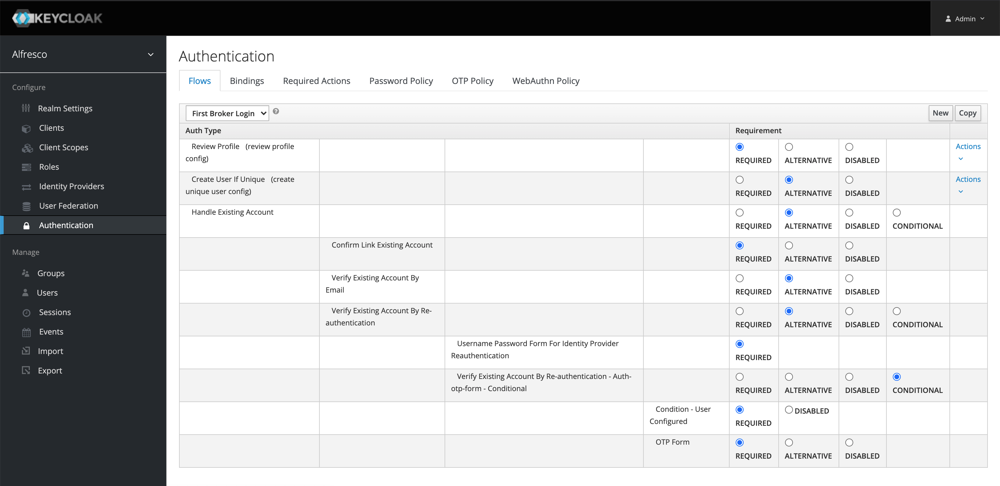

# Upgrading Identity Service

**_NOTE:_** The upgrade of the Alfresco Identity Management Service requires downtime.
This means that no user will be able to connect to any of the Digital Business Platform components while the upgrade or rollback is being done.

### Migrating to Identity Service 1.5.0
**Manual migration step needed**

Since Keycloak 13.0.0, the **_SmallRye_** modules have been removed from the underlying WildFly distribution, and the server will not start if the configuration references them. Therefore, to perform server configuration migration, you have to manually remove all the lines that refer to _SmallRye_ modules.

See Keycloak [documentation](https://www.keycloak.org/docs/latest/upgrading/#migrating-to-13-0-0) for what lines to remove from the **_standalone.xml_** file.


### Note: Upgrading from Identity Service 1.2 to a later versions
Prior to upgrading Identity Service 1.2 to a later version, make sure to first modify the **_First Broker Login_** authentication configuration as follows:

1. Logging into the admin console and select **Alfresco** realm

2. From the left menu, click **Authentication** to open the authentication config page

3. Select **First Broker Login** from the dropdown menu

4. Make sure the **Create User If Unique(create unique user config)** flow is set to **ALTERNATIVE**



5. Follow the steps in the [General upgrade procedure](#General-upgrade-procedure) section


### General upgrade procedure

For upgrading Alfresco Identity Management Service, follow Keycloak's [upgrade procedure](https://www.keycloak.org/docs/16.1/upgrading/).

However, depending on the environment you are using you should follow these high-level steps:

1. Prior to applying the upgrade, handle any open transactions and delete the data/tx-object-store/ transaction directory.

2. Back up the old installation (configuration, themes, and so on).

3. Back up the database. For detailed information on how to back up the database, see the documentation for the relational database you are using.

4. Upgrade Keycloak [server](https://www.keycloak.org/docs/16.1/upgrading/#_install_new_version).

   - Testing the upgrade in a non-production environment first, to prevent any installation issues from being exposed in production, is a best practice.

   - Be aware that after the upgrade the database will no longer be compatible with the old server

   - Ensure the upgraded server is functional before upgrading adapters in production.

5. If you need to revert the upgrade, first restore the old installation, and then restore the database from the backup copy.

### Upgrading Identity Service in Kubernetes with PostgreSQL database

#### Upgrade from chart >=1.1.0 to 2.1.0

The upgrade should be seamless.


#### Upgrade to chart >=3.0.0

1. Identify your chart release name and namespace and save them into variables.

```bash
export RELEASENAME=<Your-Release-Name>
export RELEASENAMESPACE=<Your-Release-Namespace>
```

2. Delete the postgresql StatefulSets.

```bash
kubectl delete statefulsets.apps $RELEASENAME-postgresql-id --cascade=false --namespace $RELEASENAMESPACE
```

3. Upgrade Identity Service.

```bash
helm upgrade $RELEASENAME alfresco-stable/alfresco-identity-service --version=3.0.0 --namespace $RELEASENAMESPACE
```

4. Delete the postgresql pod.

```bash
kubectl delete pod $RELEASENAME-postgresql-id-0 --namespace $RELEASENAMESPACE
```

The Identity Service should be back up in a few minutes.
